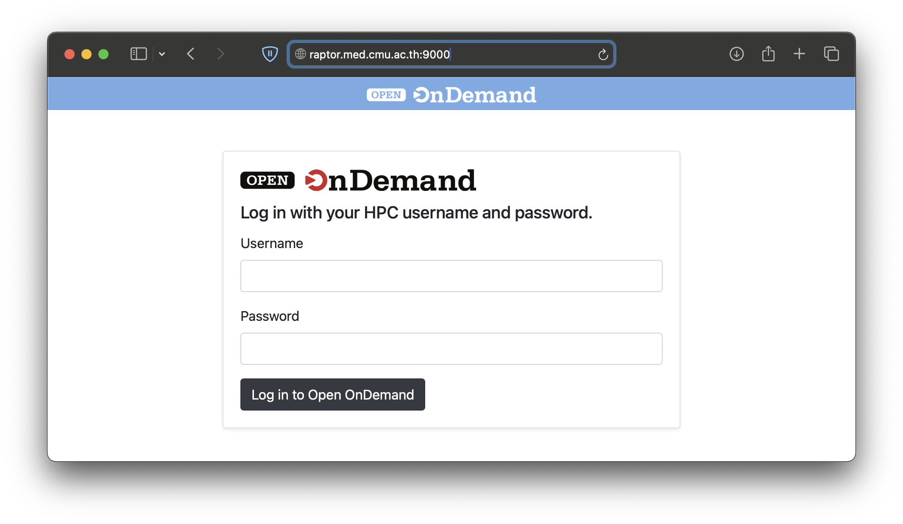
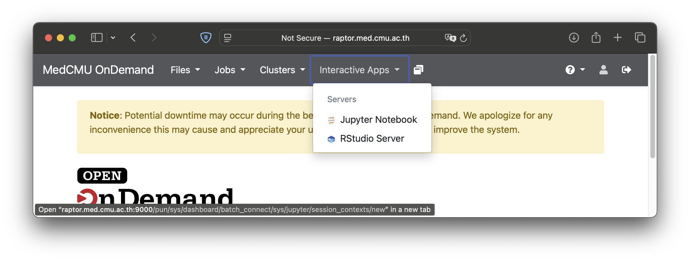
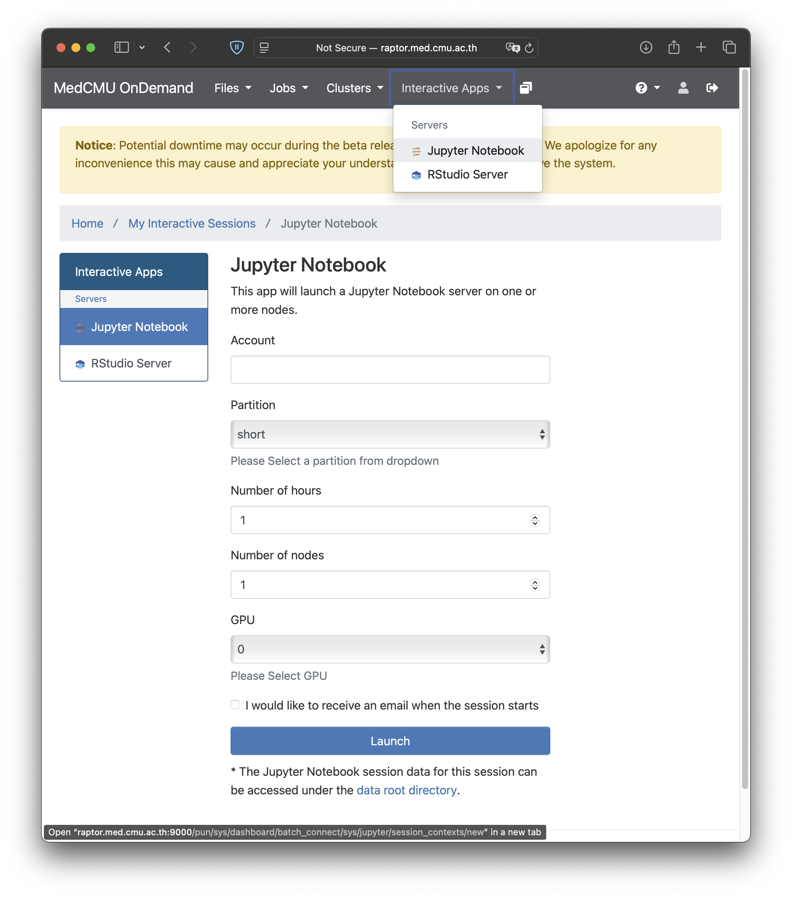
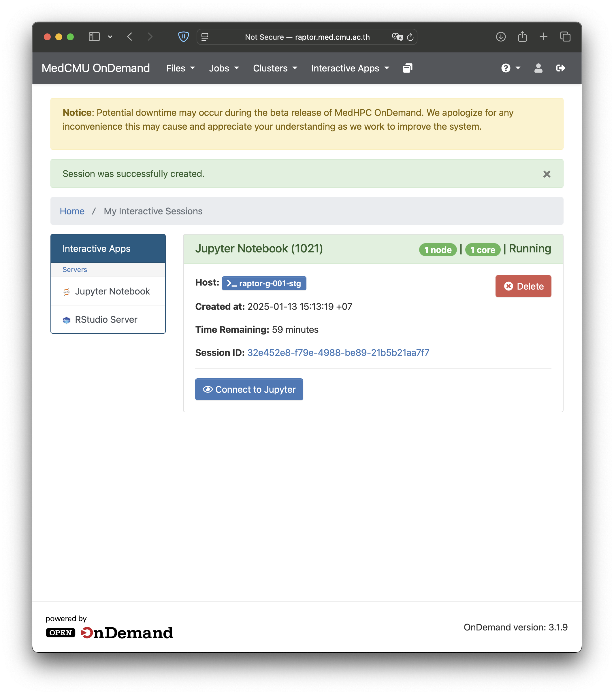

### 1. Accessing OnDemand Portal

1. Open your browser and go to the OnDemand portal website: [https://raptor.med.cmu.ac.th:9000](http://raptor.med.cmu.ac.th:9000).
2. Enter your username and password to log in to the OnDemand portal.

### 2. Launching Interactive Applications

### 3. Opening RStudio or Jupyter Apps

1. In the OnDemand portal, navigate to the **Interactive Apps** menu on the menu bar.
2. Select the desired interactive application.

### 4. Configuring Resources for Interactive Apps

1. Set up the required resources to run interactive apps:
   - **Project Account**: Enter your project account, e.g., `a250000`.
   - **Partition**: Choose a partition:
     - `short` (default) - Maximum 8 hours.
     - `compute` - For longer computations.
     - `gpu` - For GPU-enabled computations.
   - **Number of Hours**: Specify the maximum number of hours for the session.
   - **Number of Nodes**: Default is 1.
   - **GPU**: Specify the number of GPUs required (or none).
2. Click **Launch** to start the session.

### 5. Connecting to RStudio

1. Wait until the service status shows as running.
2. Click "**Connect to ...**" button to open RStudio or Jupyter.
3. Enjoy coding with the interactive app.

## 6. Closing Interactive Sessions

To close the service, on **My Interactive Sessions** press **Delete** to end the session.
