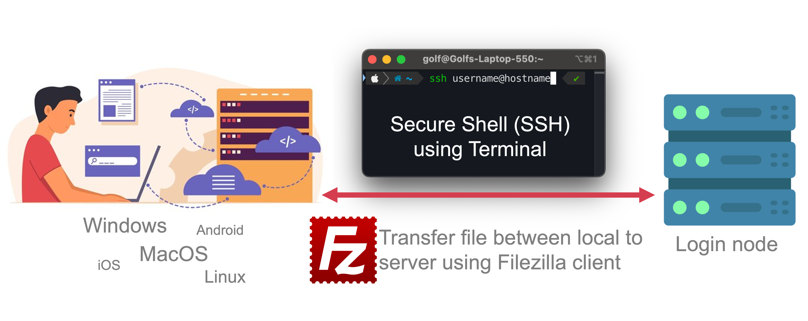

This guide shows you how to connect to your server using SSH on Linux, MacOS, or Windows.  SSH lets you securely control your server from your computer.

## Getting Started
- **SSH**: This stands for Secure Shell. It's a tool to connect to your server.
- **Username** and **Host**: You'll need this information to connect.




## Connect using SSH
1. Open a terminal window (Linux/MacOS) or command prompt (Windows).
2. Type the following command, replacing `<username>` and `<host>` with your information:
```bash
ssh <username>@<host>
```
3. Press Enter. You'll be prompted for your password. Type it in carefully (characters won't be shown while typing).

### For Windows User

We recommend  MobaXTerm (https://mobaxterm.mobatek.net/download.html). It lets you see graphics on the server without extra setup.

How to install MobaXTerm:

1. Download the portable version from https://mobaxterm.mobatek.net/download.html.
2. Unpack the downloaded file.
3. Run the program by clicking on it.
4. Click "Start a local terminal session" or press Enter.

## Passwordless login (recommend)

SSH can use *public key* authentication. SSH will create a pair of keys (long random numbers), one public and one private. You will copy the *public* key over to your account on the cluster. When you log in, SSH will use those keys to determine that you are who you are and log you in without a password. If your public key is installed on a machine, you can access it from any computer that has the corresponding private key.

Check your machine already create SSH key pair using `ls -alh ~/.ssh/id_*.pub` if not install using `ssh-keygen -t ed25519 -C "email"` read more on 

[Generating a new SSH key and adding it to the ssh-agent - GitHub Docs](https://docs.github.com/en/authentication/connecting-to-github-with-ssh/generating-a-new-ssh-key-and-adding-it-to-the-ssh-agent)

Then copy *public key* to server via command line

```bash
ssh-copy-id -i .ssh/id_xxxx.pub <username>@<host>
```

## Transfer files
Use the `scp` command to securely copy files between your computer and the server.

**Here are some examples:**
Copy a file named `file.txt` to a directory named `/dir` on the server:
```bash
scp file.txt <username>@<host>:/dir
```
Copy a file named file.txt from the server's /dir directory to your current directory:
```bash
scp <username>@<host>:/dir/file.txt .
```

:::tip
You can also use graphical tools like  FileZilla (https://filezilla-project.org/) or MobaXTerm to transfer files.
:::
