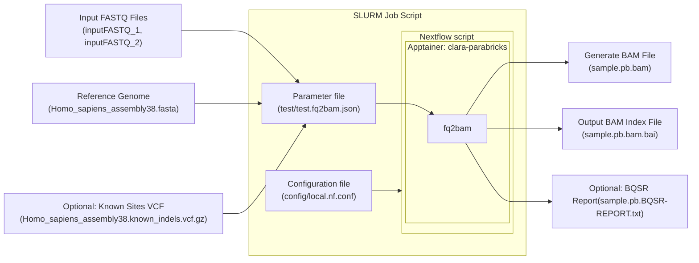

import Tabs from '@theme/Tabs';
import TabItem from '@theme/TabItem';

# Parabricks and Nextflow

This documentation provides a beginner-friendly case study on using Parabricks and Nextflow for processing genomic data with GPU acceleration. Each section explains the purpose of its code, helping you understand the pipeline setup.

## Workflow Overview

Below is a flowchart showing the pipeline's input, processing steps, and output using Mermaid syntax:

{/* ```mermaid
graph TD
    A[Input FASTQ Files] -->|InputFASTQ_1, InputFASTQ_2| B[Alignment with Parabricks: fq2bam]
    C[Reference Genome]  --> B
    D[Optional: Known Sites VCF] --> B
    B -->E[Generate BAM File]
    B --> F[Output BAM Index File]
    B --> G[Optional: BQSR Report]
``` */}



<Tabs>
  <TabItem value="SLURM" label="SLURM Job Script">
    ```bash title="fq2bam.sbatch"
    #!/bin/bash
    #SBATCH --job-name=test_parabrick       # Descriptive job name
    #SBATCH --partition=short               # GPU-enabled partition
    #SBATCH --gpus=2                        # Request 2 GPUs
    #SBATCH --time=01:00:00                 # Maximum runtime (hh:mm:ss)
    #SBATCH --cpus-per-task=94              # Number of CPU cores required
    #SBATCH --mem=300G                      # Memory allocation
    #SBATCH --output=test_parabrick_%j.log  # Output log file
    #SBATCH --error=test_parabrick_%j.error # Error log file

    # Load necessary modules
    ml apptainer
    ml nextflow

    # Define paths to the configuration and scripts
    CONFIG="/home/nattawet.sri/demo/parabricks-nextflow/config/local.nf.conf"
    PARAMS="/home/nattawet.sri/demo/parabricks-nextflow/example_inputs/real.fq2bam.json"
    NF_SCRIPT="/home/nattawet.sri/demo/parabricks-nextflow/nextflow/fq2bam.nf"

    # Run the Nextflow pipeline
    nextflow run \
      -c ${CONFIG} \
      -params-file ${PARAMS} \
      ${NF_SCRIPT}
    ```
    This script submits a job to the SLURM scheduler, loading the required modules and running the pipeline using your configuration and input files.
  </TabItem>

  <TabItem value="nf-fq2bam" label="Nextflow Pipeline Script">
    ```bash title="nextflow/fq2bam.nf"
    #!/usr/bin/env nextflow

    nextflow.enable.dsl = 2

    process fq2bam {
      input:
      path inputFASTQ_1
      path inputFASTQ_2
      path inputRef
      path inputKnownSitesVCF

      output:
      path "${inputFASTQ_1.baseName}.pb.bam"
      path "${inputFASTQ_1.baseName}.pb.bam.bai"
      path "${inputFASTQ_1.baseName}.pb.BQSR-REPORT.txt"

      script:
      def knownSitesStub = inputKnownSitesVCF ? "--knownSites ${inputKnownSitesVCF}" : ''
      def recalStub = inputKnownSitesVCF ? "--out-recal-file ${inputFASTQ_1.baseName}.pb.BQSR-REPORT.txt" : ''

      """
      pbrun fq2bam \
      --in-fq ${inputFASTQ_1} ${inputFASTQ_2} \
      --ref ${inputRef} \
      --out-bam ${inputFASTQ_1.baseName}.pb.bam \
      ${knownSitesStub} \
      ${recalStub} \
      --num-gpus 2
      """
    }

    workflow Parabricks_fq2bam {
      fq2bam(
        inputFASTQ_1=params.inputFASTQ_1,
        inputFASTQ_2=params.inputFASTQ_2,
        inputRef=params.inputRef, 
        inputKnownSitesVCF=params.inputKnownSitesVCF
      )
    }

    workflow {
        Parabricks_fq2bam()
    }
    ```
    This Nextflow script defines the pipeline for converting FASTQ files to a BAM file using Parabricks with optional Base Quality Score Recalibration (BQSR).
  </TabItem>
  <TabItem value="nf-sample" label="Input JSON File" default>
    ```bash title="test/test.fq2bam.json"
    {
      "inputFASTQ_1" : "/scratch/demo/DC089_OS_bx_1.fastq.gz",
      "inputFASTQ_2" : "/scratch/demo/DC089_OS_bx_2.fastq.gz",
      "inputRef" : "/home/nattawet.sri/demo/parabricks_sample/Ref/Homo_sapiens_assembly38.fasta", 
      "inputKnownSitesVCF" : "/home/nattawet.sri/demo/parabricks_sample/Ref/Homo_sapiens_assembly38.known_indels.vcf.gz"
    }

    ```
    This JSON file specifies the input files required for the pipeline. Update the file paths to match your local environment.
  </TabItem>

  <TabItem value="nf-config" label="Configuration File">
    ```bash title="config/local.nf.conf"
    process {
      container = '/common/sif/clara-parabricks/4.4.0.sif'
      maxForks = 1
      containerOptions = { workflow.containerEngine == "apptainer" ? '--nv': 
        ( workflow.containerEngine == "docker" ? '--gpus all': null ) }
    }

    apptainer.enabled = true
    ```
    This configuration file specifies settings for the pipeline, including the container image to use and options for GPU acceleration.
  </TabItem>
</Tabs>

## Additional Notes

- **Understanding the Workflow:** The pipeline takes raw sequencing data (FASTQ files), aligns it to a reference genome, and produces a BAM file, optionally applying BQSR.
- **Modular Design:** The configuration file allows for easy adjustments to container paths and other settings.
- **Execution:** Update paths in the JSON file to match your environment and ensure necessary modules (`apptainer`, `nextflow`) are loaded before running.

This documentation is designed to simplify the process for beginners while providing detailed explanations for each step.
