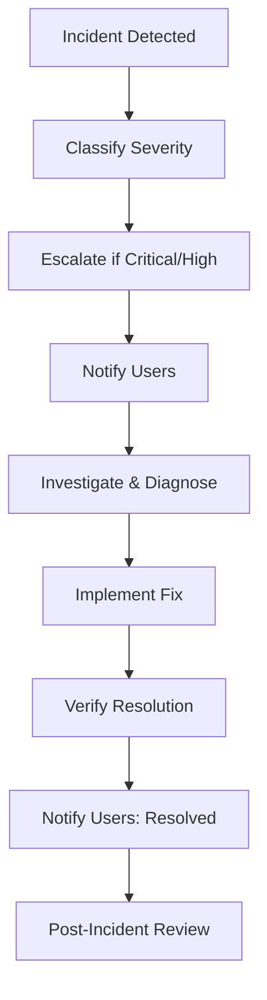

import SOPHeader from '@site/src/components/SOPHeader';

<SOPHeader
  documentCode="SOP-HPC-A005"
  title="Incident Response"
  version="1.0"
  status="Draft"
  effectiveDate="2026-01-18"
  category="Admin SOP"
  approvedBy="-"
  authors="Nattawet Sriwichai"
  lastUpdated="2026-01-18"
/>

## Purpose

To define protocols for handling system incidents, outages, and security events on the MedCMU-HPC cluster.

## Scope

Applies to system outages, hardware failures, security incidents, and performance degradation.

## Roles & Responsibilities

| Role                  | Responsibility                                |
| --------------------- | --------------------------------------------- |
| **HPC Administrator** | Detects, investigates, and resolves incidents |
| **Department Head**   | Receives escalations for critical incidents   |
| **Security Team**     | Handles security-related incidents            |

## Incident Classification

| Severity     | Description                    | Response Time     |
| ------------ | ------------------------------ | ----------------- |
| **Critical** | Complete system outage         | Immediate         |
| **High**     | Major functionality impaired   | < 1 hour          |
| **Medium**   | Partial service impact         | < 4 hours         |
| **Low**      | Minor issue, workaround exists | Next business day |

## Process Flow



## Key Diagnostic Commands

### Job Queue Monitoring

```bash
squeue -o "%.18i %.9P %.20j %.8a %.20u %.2t %.10M %.10l %.6D %.6C %.10m %10b %R"
```

### Job Diagnostics

| Command                                                          | Purpose           |
| ---------------------------------------------------------------- | ----------------- |
| `sacct --jobs=<id> --format=jobname,nnodes,ncpus,maxrss,elapsed` | Resource usage    |
| `sacct -j <jobid> --batch`                                       | View batch script |
| `scontrol show jobid -dd <jobid>`                                | Detailed job info |

### Node Troubleshooting

| Command                     | Purpose               |
| --------------------------- | --------------------- |
| `sinfo -R`                  | Check node status     |
| `scontrol show node <name>` | Inspect node details  |
| `sdiag`                     | Scheduler diagnostics |

## Resolution

```bash
# Resume drained nodes
scontrol update nodename=<name> state=resume reason="Fixed: issue resolved"

# Verify services
sinfo
srun -p short hostname
```

## Security Incidents

:::warning
Do not attempt to investigate security incidents without proper authorization. Preserve system state and escalate immediately.
:::

## Expected Outcome

- ✅ Incident resolved and services restored
- ✅ Users informed throughout the process
- ✅ Root cause documented

## Related Documents

- [SOP-HPC-A004: System Maintenance](./system-maintenance)
