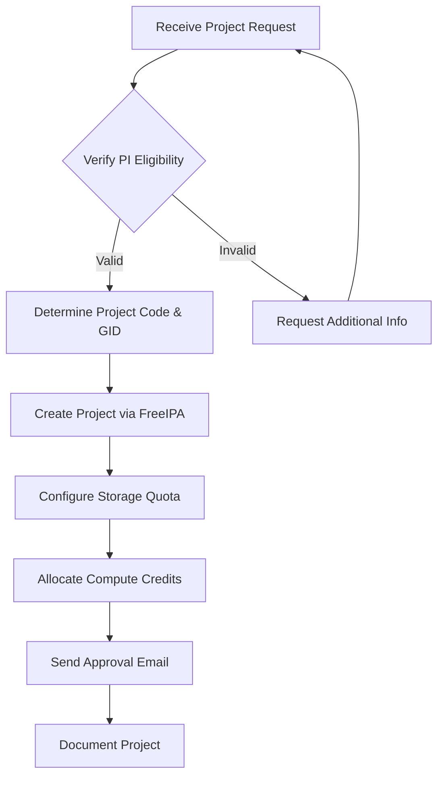

import SOPHeader from '@site/src/components/SOPHeader';

<SOPHeader
  documentCode="SOP-HPC-A002"
  title="Project Approval"
  version="1.0"
  status="Draft"
  effectiveDate="2026-01-18"
  category="Admin SOP"
  approvedBy="-"
  authors="Nattawet Sriwichai"
  lastUpdated="2026-01-18"
/>

## Purpose

To define the procedure for reviewing, approving, and provisioning research project registrations on MedCMU-HPC, including storage allocation and compute credit assignment.

## Scope

Applies to HPC support staff responsible for project resource allocation.

## Roles & Responsibilities

| Role                            | Responsibility                                            |
| ------------------------------- | --------------------------------------------------------- |
| **HPC Administrator**           | Reviews application, creates project, allocates resources |
| **Principal Investigator (PI)** | Submits project registration, manages team members        |
| **Team Members**                | Request to join existing projects                         |

## Prerequisites

- Access to project registration submissions
- Root/admin access to HPC login node
- FreeIPA admin credentials
- Access to PowerScale web interface (10.128.1.24:8080)

## Project Coding System

### Project ID Format

| Code Pattern        | Description                          |
| ------------------- | ------------------------------------ |
| `a26XXXX_ShortName` | AI project number XXXX of 2026       |
| `o26XXXX_ShortName` | Omics project number XXXX of 2026    |
| `w26XXXX_ShortName` | Workshop project number XXXX of 2026 |

**Examples**:

- `a260001_ShortName` - AI project #1 of 2026
- `o260003_ShortName` - Omics project #3 of 2026

### GID Code System

| Group Category              | Sub Group                             | GID Range |
| --------------------------- | ------------------------------------- | --------- |
| **Research Project Groups** |                                       | 4XXXX     |
|                             | Projects related to SRU               | 41XXX     |
|                             | Projects related to SBU               | 42XXX     |
|                             | Projects related to CRU               | 43XXX     |
|                             | Projects related to FGU               | 44XXX     |
|                             | Projects related to MGU               | 45XXX     |
|                             | Projects related to BioChem           | 46XXX     |
|                             | Projects related to BioCE             | 47XXX     |
|                             | Projects related to RADIO             | 48XXX     |
|                             | Projects related to Micro             | 49XXX     |
|                             | Projects related to Hematology        | 51XXX     |
|                             | Projects related to Internal Medicine | 51XXX     |
|                             | Projects related to Ophthalmology     | 52XXX     |
| **Special Groups**          |                                       | 6XXXX     |
|                             | Common                                | 60001     |
|                             | Workshop                              | 62001     |

## Process Flow



## Procedure

### Step 1: Receive Project Request

1. Monitor project registration form submissions at [Project Registration Form](https://o365cmu-my.sharepoint.com/:x:/g/personal/nattawet_sri_cmu_ac_th/EZ1ZNGG6RJ1NtHp8VMydU3YBM7Fo779Xi92rOWAYLPuZiQ?e=75sket)
2. Check for pending project applications daily
3. Verify all required information is provided

### Step 2: Review Project Requirements

Evaluate the following:

| Aspect           | Considerations                              |
| ---------------- | ------------------------------------------- |
| PI Eligibility   | Valid faculty member or approved researcher |
| Research Purpose | Aligned with MedCMU research objectives     |
| Resource Request | Reasonable for stated research goals        |
| Team Members     | All have valid HPC accounts                 |

**Escalation required if**:

- Storage request > 5 TB
- GPU allocation > 4 GPUs
- Extended priority queue access
- External collaborators involved

### Step 3: Determine Resource Allocation

**Default Storage Allocation**:

| Project Type       | /project Quota | /scratch Quota |
| ------------------ | -------------- | -------------- |
| Small (1-2 users)  | 500 GB         | 500 GB         |
| Medium (3-5 users) | 1 TB           | 1 TB           |
| Large (6+ users)   | 2 TB           | 1 TB           |
| Data-intensive     | Case-by-case   | Case-by-case   |

**Default Compute Allocation**:

- **198.26 Service Hours (SHr)** per project per allocation period

### Step 4: Create Project via FreeIPA

1. **SSH to login node and authenticate**:

   ```bash
   ssh user@raptor.med.cmu.ac.th
   cd script
   kinit admin
   ```

2. **Create the project using the script**:

   ```bash
   ./createProject.sh -n <ProjectName> -i <ProjectID> -g <GID> -u <users> -o <org> -d '<description>'
   ```

   **Script options**:
   | Option | Description |
   |--------|-------------|
   | `-n, --name` | Project short name |
   | `-i, --id` | Project ID (e.g., a250007) |
   | `-g, --gid` | Group ID from GID Code System |
   | `-u, --user` | Comma-separated list of usernames |
   | `-o, --org` | Organization/Department |
   | `-d, --desc` | Project description |

   **Example**:

   ```bash
   ./createProject.sh -n ProjectShortName -i a25XXXXX -g a26XXXXX -u user1,user2,user3 -o OrganizationName -d 'Project description'
   ```

3. **Clear SSSD cache**:

   ```bash
   sss_cache -E
   ```

### Step 5: Configure Storage Quota via PowerScale

1. Navigate to [PowerScale Admin UI](https://10.128.1.24:8080/)
2. Login with administrator credentials
3. Go to **File System > SmartQuotas**
4. Find the GID on `/project` directory
5. Click **Unlink**
6. Click **View/Edit**
7. Set **Hard limit value** as per allocation
8. Click **Save**

Repeat for `/scratch` directory if needed.

### Step 6: Allocate Compute Credits

**Computing Service Unit (SU) calculation**:

```
Service Hours (SHr) × 60 Minutes × Cores = Core Minutes
Example: 298.26 SHr × 60 × 94 = 1,717,977.6 Core Minutes
```

**Apply allocation via SLURM**:

```bash
ProjectID=a26XXXXX
sacctmgr modify qos where qos=$ProjectID set GrpTRESMins=billing=1717977.6
```

### Step 7: Add Additional Users (if needed)

To add more users to an existing project:

```bash
./addProjectUser.sh -i <ProjectID> -u <user1,user2,user3>
```

**Example**:

```bash
./addProjectUser.sh -i a26XXXXX -u user1,user2
```

### Step 8: Send Approval Email

```text
Subject: MedCMU-HPC Project Approved - [Project Name]

Dear [PI Name],

Your project registration has been approved.

Project Information
-------------------
Project Name: [ProjectName]
Project ID: [ProjectID]
Project Directory: /project/[ProjectID]
Scratch Directory: /scratch/[ProjectID]
Storage Quota: [X] GB (project) / [Y] GB (scratch)
Compute Allocation: 198.26 Service Hours
Team Members: [list]

Getting Started
---------------
1. Access your project: cd /project/[ProjectID]
2. Check your quota: myquota
3. Check compute balance: sbalance
4. Add team members: Contact HPC team

For questions, contact: supporthpc-med@cmu.ac.th

Best regards,
MedCMU-HPC Team
```

### Step 9: Document the Project

Log in the [Collection Spreadsheet](https://o365cmu-my.sharepoint.com/:x:/g/personal/nattawet_sri_cmu_ac_th/EbocnXsQTsZLlJgaIGEFXp0BIhIIAhuPZMtUK07JwYM-uQ?e=vyKHOA):

- Project name and ID
- PI name and contact
- Team members
- GID
- Allocated resources
- Start date and expected end date

## Expected Outcome

- ✅ Project directory created at `/project/<ProjectID>`
- ✅ Scratch directory created at `/scratch/<ProjectID>`
- ✅ Storage quotas configured
- ✅ Compute credits allocated
- ✅ Team members have access
- ✅ PI is notified
- ✅ Project documented

## Related Documents

- [SOP-HPC-A001: User Onboarding](./user-onboarding)
- [SOP-HPC-A003: Resource Allocation](./resource-allocation)
- [SOP-HPC-U002: Project Registration](/docs/SOP/User/project-registration)
