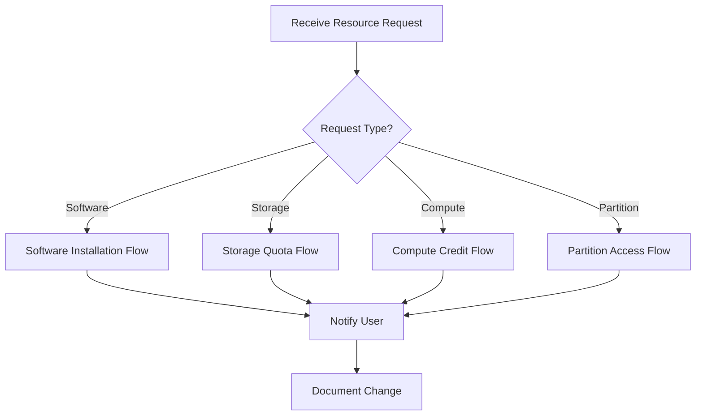

import SOPHeader from '@site/src/components/SOPHeader';

<SOPHeader
  documentCode="SOP-HPC-A003"
  title="Resource Allocation"
  version="1.0"
  status="Draft"
  effectiveDate="2026-01-18"
  category="Admin SOP"
  approvedBy="-"
  authors="Nattawet Sriwichai"
  lastUpdated="2026-01-18"
/>

## Purpose

To define procedures for processing resource change requests including software installation, storage quota adjustments, and compute allocation modifications.

## Scope

Applies to requests for:

- Software installation (EasyBuild, manual, containers)
- Storage quota changes
- Compute credit adjustments
- Special partition access

## Roles & Responsibilities

| Role                  | Responsibility                                         |
| --------------------- | ------------------------------------------------------ |
| **HPC Administrator** | Evaluates requests, installs software, modifies quotas |
| **User**              | Submits resource requests with justification           |
| **PI**                | Approves requests for team members                     |

## Prerequisites

- Root/admin access to HPC systems
- Access to `modules` user account for EasyBuild
- Access to PowerScale web interface
- Knowledge of SLURM accounting

## Process Flow



---

## Software Installation Procedures

### Method A: EasyBuild Installation

EasyBuild automates software installation with consistent, reproducible builds.

#### Step 1: Login as Modules User

```bash
ssh user@raptor.med.cmu.ac.th
su - modules
```

#### Step 2: Search for Existing EasyConfig

```bash
eb -S <software_name>
```

**View easyconfig details**:

```bash
eb --show-ec <software_name_version>.eb
```

#### Step 3: Perform Dry Run

Test the build without executing:

```bash
eb -Dr <easyconfig_file.eb>
```

#### Step 4: Build the Software

:::warning
Large software builds can take hours. **Submit the build as a SLURM job** for complex installations.
:::

```bash
eb -r <easyconfig_file.eb>
```

#### Step 5: Verify Installation

```bash
module avail <software_name>
module load <software_name>/<version>
```

---

### Method B: Manual Installation with Environment Modules

#### Directory Structure

| Component         | Path                                           |
| ----------------- | ---------------------------------------------- |
| Software binaries | `/apps/<software_name>/<version>/bin/*`        |
| Module files      | `/apps/.modulefiles/<software_name>/<version>` |

#### Module File Template

Create `/apps/.modulefiles/<software_name>/<version>`:

```tcl
#%Module1.0##################################################################

set appname    [lrange [split [module-info name] {/}] 0 0]
set appversion [lrange [split [module-info name] {/}] 1 1]
set apphome    /apps/$appname/$appversion

module-whatis   "Description of the software"

conflict $appname
prepend-path PATH $apphome/bin
```

---

### Method C: Apptainer Container Deployment

Pre-built containers are stored at `/common/sif/<software_name>/<version>.sif`

**Available containers include**: AlphaFold 2, Clara Parabricks, GROMACS, TensorFlow

---

## Storage Quota Procedures

### Checking Current Usage

```bash
myquota
```

### Modifying Storage Quota via PowerScale

1. Navigate to [PowerScale Admin UI](https://10.128.1.24:8080/)
2. Go to **File System > SmartQuotas**
3. Find the user/group quota entry
4. Click **View/Edit** and set new **Hard limit value**
5. Click **Save**

---

## Compute Credit Procedures

### Checking Credit Balance

```bash
sbalance
```

### Adding Compute Credits

**Calculation**: `SHr × 60 × Cores = Core Minutes`

```bash
ProjectID=a250001
sacctmgr modify qos where qos=$ProjectID set GrpTRESMins=billing=1717977.6
```

---

## Expected Outcome

- ✅ Requested resource change is implemented
- ✅ User is notified of completion
- ✅ Change is documented in tracking system

## Related Documents

- [SOP-HPC-A002: Project Approval](./project-approval)
- [SOP-HPC-A006: Software Installation](./software-installation)
- [SOP-HPC-U003: Request Resources](/docs/SOP/User/request-resources)
