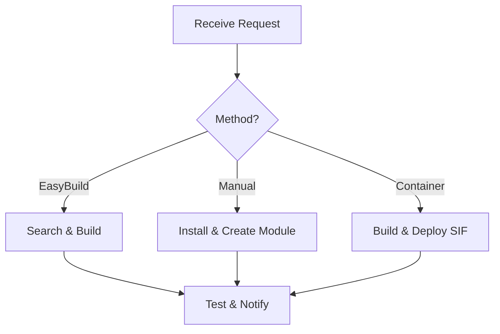

import SOPHeader from '@site/src/components/SOPHeader';

<SOPHeader
  documentCode="SOP-HPC-A006"
  title="Software Installation"
  version="1.0"
  status="Draft"
  effectiveDate="2026-01-18"
  category="Admin SOP"
  approvedBy="-"
  authors="Nattawet Sriwichai"
  lastUpdated="2026-01-18"
/>

## Purpose

To define procedures for installing software on MedCMU-HPC using EasyBuild, manual installation, and Apptainer containers.

## Scope

Applies to all software installation requests including scientific software, development tools, and containerized applications.

## Roles & Responsibilities

| Role                  | Responsibility                         |
| --------------------- | -------------------------------------- |
| **HPC Administrator** | Installs and maintains software        |
| **User**              | Submits software installation requests |

## Process Flow



## Method A: EasyBuild

```bash
# Login as modules user
su - modules

# Search for easyconfig
eb -S <software_name>

# Dry run
eb -Dr <easyconfig.eb>

# Build
eb -r <easyconfig.eb>

# Verify
module avail <software_name>
```

## Method B: Manual Installation

| Component | Path                                      |
| --------- | ----------------------------------------- |
| Software  | `/apps/<software>/<version>/bin/*`        |
| Modules   | `/apps/.modulefiles/<software>/<version>` |

### Module File Template

```tcl
#%Module1.0
set apphome /apps/$appname/$appversion
module-whatis "Description"
prepend-path PATH $apphome/bin
```

## Method C: Apptainer Container

### Available Containers

| Software         | Path                                       |
| ---------------- | ------------------------------------------ |
| AlphaFold 2      | `/common/sif/alphafold2/2.0.0.sif`         |
| Clara Parabricks | `/common/sif/clara-parabricks/4.4.0.sif`   |
| GROMACS          | `/common/sif/gromacs/2023.2.sif`           |
| TensorFlow       | `/common/sif/tensorflow/24.10-tf2-py3.sif` |

### Build New Container

```bash
module load apptainer
apptainer build <software>.sif <software>.def
mv <software>.sif /common/sif/<software>/<version>.sif
```

## Expected Outcome

- ✅ Software installed and accessible
- ✅ Module file created
- ✅ User notified with usage instructions

## Related Documents

- [SOP-HPC-A003: Resource Allocation](./resource-allocation)
