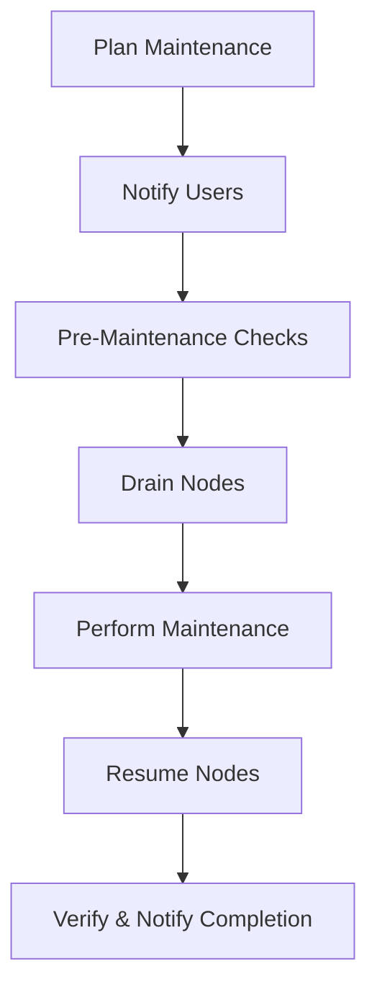

import SOPHeader from '@site/src/components/SOPHeader';

<SOPHeader
  documentCode="SOP-HPC-A004"
  title="System Maintenance"
  version="1.0"
  status="Draft"
  effectiveDate="2026-01-18"
  category="Admin SOP"
  approvedBy="-"
  authors="Nattawet Sriwichai"
  lastUpdated="2026-01-18"
/>

## Purpose

To define protocols for scheduled and emergency system maintenance activities on the MedCMU-HPC cluster.

## Scope

Applies to all planned maintenance activities including software updates, hardware maintenance, security patches, and system reboots.

## Roles & Responsibilities

| Role                  | Responsibility                                          |
| --------------------- | ------------------------------------------------------- |
| **HPC Administrator** | Plans and executes maintenance, communicates with users |
| **Users**             | Save work before maintenance windows                    |
| **Department Head**   | Approves major maintenance windows                      |

## Cluster Node Reference

| Node Type  | Hostname            | Management IP | Storage IP |
| ---------- | ------------------- | ------------- | ---------- |
| Login      | **raptor**          |               |            |
| CPU/Memory | raptor-m-001 to 004 |               |            |
| GPU        | raptor-g-001, 002   |               |            |

## Process Flow



## Procedure

### Notification Timeline

| Notice Period | Maintenance Type              |
| ------------- | ----------------------------- |
| 1 week        | Major updates, full outage    |
| 3 days        | Partial outage, node-specific |
| 24 hours      | Reminder                      |

### Key Commands

```bash
# Drain nodes
scontrol update nodename=all state=drain reason="Maintenance"

# Perform updates
dnf update -y

# Resume nodes
scontrol update nodename=all state=resume
```

### Node Troubleshooting

| Command                     | Purpose               |
| --------------------------- | --------------------- |
| `sinfo -R`                  | Check node status     |
| `scontrol show node <name>` | Inspect node details  |
| `sdiag`                     | Scheduler diagnostics |

## Expected Outcome

- ✅ Maintenance completed within scheduled window
- ✅ All nodes returned to normal state
- ✅ Users notified of completion

## Related Documents

- [SOP-HPC-A005: Incident Response](./incident-response)
