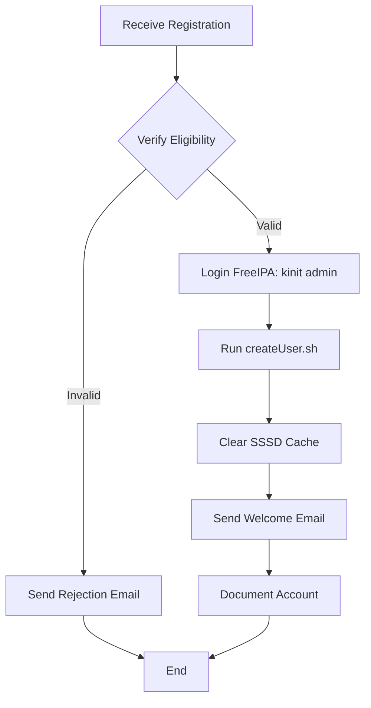

import SOPHeader from '@site/src/components/SOPHeader';

<SOPHeader
  documentCode="SOP-HPC-A001"
  title="User Onboarding"
  version="1.0"
  status="Draft"
  effectiveDate="2026-01-18"
  category="Admin SOP"
  approvedBy="-"
  authors="Nattawet Sriwichai"
  lastUpdated="2026-01-18"
/>

## Purpose

To define the procedure for creating and onboarding new user accounts on the MedCMU-HPC system using FreeIPA identity management.

## Scope

Applies to HPC support staff responsible for user account management.

## Roles & Responsibilities

| Role                  | Responsibility                                           |
| --------------------- | -------------------------------------------------------- |
| **HPC Administrator** | Verifies application, creates account, sends credentials |
| **User**              | Submits registration form, performs first login          |
| **Supervisor/PI**     | Approves student/RA applications                         |

## Prerequisites

- Root/admin access to HPC login node
- FreeIPA admin credentials
- Access to user registration form responses

## Process Flow



## Procedure

### Step 1: Receive Registration Request

1. Monitor the registration form responses at the [User Registration Form](https://cmu.to/medcmu-hpc-user-register)
2. Check daily for pending applications
3. Review registration data in the [Collection Spreadsheet](https://o365cmu-my.sharepoint.com/:x:/g/personal/nattawet_sri_cmu_ac_th/EbocnXsQTsZLlJgaIGEFXp0BIhIIAhuPZMtUK07JwYM-uQ?e=vyKHOA)

### Step 2: Verify Application

Review the following criteria:

| Criterion   | Verification Method               |
| ----------- | --------------------------------- |
| CMU Email   | Must be valid @cmu.ac.th address  |
| Affiliation | Member of Faculty of Medicine     |
| Purpose     | Research or educational use       |
| Supervisor  | Valid supervisor for students/RAs |

**Red flags to check**:

- ❌ Non-institutional email
- ❌ Vague or unclear research purpose
- ❌ Unable to verify affiliation

### Step 3: Create User Account via FreeIPA

1. **Login via SSH to the login node**:

   ```bash
   ssh user@raptor.med.cmu.ac.th
   ```

2. **Navigate to the script directory**:

   ```bash
   cd script
   # Or if root: cd /root/script
   ```

3. **Authenticate to FreeIPA**:

   ```bash
   kinit admin
   # Enter admin password when prompted
   ```

4. **Create the user account**:

   ```bash
   ./createUser.sh -u <username> -n <first_name> -l <last_name> -o <org_unit>
   ```

   **Script options**:
   | Option | Description |
   |--------|-------------|
   | `-u` | User's login username (format: `firstname.las`) |
   | `-n` | User's first name |
   | `-l` | User's last name |
   | `-o` | User's organizational unit/department |

   **Example**:

   ```bash
   ./createUser.sh -u username -n FirstName -l LastName -o OrganizationName
   ```

5. **Clear SSSD cache** to force immediate user recognition:

   ```bash
   sss_cache -E
   ```

### Step 4: Send Welcome Email

Send the following email template to the new user:

```text
Subject: MedCMU-HPC Account Created - Welcome!

Dear [USER],

Hope this mail finds you well!

We are pleased to provide you with access details for the MedCMU-HPC,
available to staff/students in the Faculty of Medicine, Chiang Mai University.

Account Information
-------------------
Username: [username]
First login password: [generated_password]
Host: raptor.med.cmu.ac.th
Home Directory: /home/[username]
Home Directory Quota: 100 GB

Please keep in mind that your credentials account is prohibited to share
with others. Outside university should be accessed via VPN.

We require you to reset the password at the first time after you login SSH
via terminal. Type the first login password twice, then your new password twice.

A project investigator (PI) should submit a project registration form before
operating the MedCMU-HPC.

Getting Started
---------------
To help you get started using the server effectively, we recommend you refer
to the online user guide available at https://cmu.to/medcmu-hpc

This guide provides valuable information on:
- How to connect to the server
- Essential Unix/Linux commands
- Using Environmental Modules
- Jupyter and RStudio in OnDemand
- Running containers with SLURM

Requesting Software Installation
--------------------------------
If you require additional tools or software to be installed on the server,
please contact us via: https://cmu.to/medcmu-hpc-req

Support
-------
For any questions or concerns regarding your server access,
feel free to contact supporthpc-med@cmu.ac.th

Or consult with the HPC support team at https://cal.com/nattawet-sri/30min

Hope you enjoy the research work with HPC!

Kind regards,
MedCMU HPC Support
```

### Step 5: Document the Account

1. Log the account creation in the tracking spreadsheet
2. Record:
   - Username
   - Creation date
   - Supervisor/PI
   - Department/Organization

## Expected Outcome

- ✅ User account is active in FreeIPA
- ✅ User can SSH to `raptor.med.cmu.ac.th`
- ✅ User has received welcome email with credentials
- ✅ Account is documented in tracking system

## Rejection Procedure

If application is rejected:

1. Document reason for rejection
2. Send notification email explaining the issue
3. Provide instructions for resubmission if applicable

## Related Documents

- [SOP-HPC-A002: Project Approval](./project-approval)
- [SOP-HPC-U001: User Account Registration](/docs/SOP/User/account-registration)
