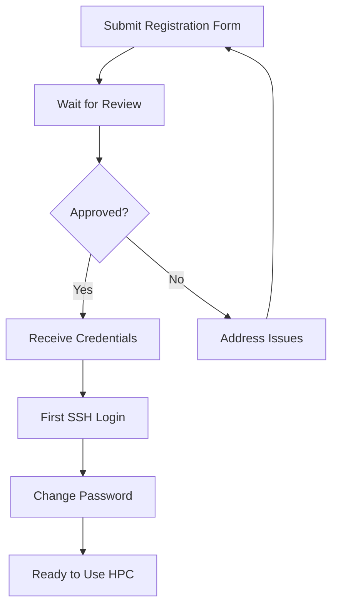

import SOPHeader from '@site/src/components/SOPHeader';

<SOPHeader
  documentCode="SOP-HPC-U001"
  title="Account Registration"
  version="1.0"
  status="Draft"
  effectiveDate="2026-01-18"
  category="User SOP"
  approvedBy="-"
  authors="Nattawet Sriwichai"
  lastUpdated="2026-01-18"
/>

## Purpose

To guide new users through the HPC account registration and first login process.

## Scope

Applies to all new users requesting access to MedCMU-HPC resources.

## Roles & Responsibilities

| Role                  | Responsibility                                  |
| --------------------- | ----------------------------------------------- |
| **User**              | Submits registration form, performs first login |
| **Supervisor/PI**     | Approves student/RA applications                |
| **HPC Administrator** | Processes registration, creates account         |

## Prerequisites

- Valid CMU email address (@cmu.ac.th)
- Affiliation with Faculty of Medicine, Chiang Mai University
- Supervisor/PI approval (for students and research assistants)
- For off-campus access: CMU VPN configured

## Process Flow



## Procedure

### Step 1: Submit Registration Form

1. Navigate to the **[HPC User Registration Form](https://cmu.to/medcmu-hpc-user-register)**

2. Complete all required fields:
   - Personal information (name, email, department)
   - Academic position
   - Research area/purpose for using HPC
   - Supervisor information (if applicable)

3. Review your submission and click **Submit**

### Step 2: Wait for Approval

- The HPC team will review your application within **5 business days**
- You will receive a confirmation email at your CMU email address
- If additional information is needed, you will be contacted via email

### Step 3: Receive Account Credentials

Once approved, you will receive an email containing:

- Your **username** (format: `firstname.las`)
- Your **temporary password**
- Login host: `raptor.med.cmu.ac.th`
- Your home directory path: `/home/<username>`
- Home directory quota: **100 GB**

### Step 4: First Login via SSH

1. **Open your terminal** (Terminal on macOS/Linux, PowerShell or PuTTY on Windows)

2. **Connect to the HPC login node**:

   ```bash
   ssh <your_username>@raptor.med.cmu.ac.th
   ```

3. **Enter your temporary password** when prompted

### Step 5: Change Your Password

On first login, you **must** change your password:

1. Enter your temporary password **twice** (once to authenticate, once to confirm old password)
2. Enter your new password **twice**

**Password requirements**:

- Minimum 12 characters
- Mix of uppercase, lowercase, numbers, and special characters
- Cannot reuse recent passwords

### Step 6: Verify Access

Confirm your account is working:

```bash
# Check your home directory
pwd
# Should show: /home/<your_username>

# Check your quota
myquota

# View available software
module avail
```

## Expected Outcome

- ✅ User has a valid HPC account
- ✅ User can successfully SSH into the login node
- ✅ User has changed their password
- ✅ User is ready to submit jobs or join a research project

## Next Steps

After account creation:

1. **Join or create a project** - See [Project Registration](./project-registration)
2. **Learn to submit jobs** - See [Getting Started](/docs/intro)
3. **Request software** if needed - See [Request Resources](./request-resources)

## Troubleshooting

| Issue             | Solution                                   |
| ----------------- | ------------------------------------------ |
| Cannot connect    | Check VPN if off-campus, verify hostname   |
| Password rejected | Reset password via HPC support             |
| Account not found | Wait 5 business days, then contact support |

## Related Documents

- [SOP-HPC-U002: Project Registration](./project-registration)
- [Getting Started](/docs/intro)
- [Connecting to the Cluster](/docs/Documentation/connect-server)
