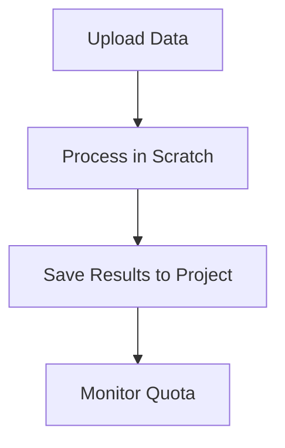

import SOPHeader from '@site/src/components/SOPHeader';

<SOPHeader
  documentCode="SOP-HPC-U004"
  title="Data Management"
  version="1.0"
  status="Draft"
  effectiveDate="2026-01-18"
  category="User SOP"
  approvedBy="-"
  authors="Nattawet Sriwichai"
  lastUpdated="2026-01-18"
/>

## Purpose

To establish guidelines for managing research data on the MedCMU-HPC system.

## Scope

Applies to all users storing and processing data on HPC resources.

## Storage Locations

| Location               | Purpose        | Quota  | Backup |
| ---------------------- | -------------- | ------ | ------ |
| `/home/<username>`     | Personal files | 100 GB | ✅ Yes |
| `/project/<ProjectID>` | Project data   | 1 TB   | ✅ Yes |
| `/scratch/<ProjectID>` | Temporary      | 1 TB   | ❌ No  |

:::warning
Data in `/scratch/` is **NOT backed up** and may be purged periodically.
:::

## Process Flow



## Checking Your Quota

```bash
myquota
```

**Example output**:

```
              Path  Remaining(%)  Allocation(GB)  Used(GB)  Remaining(GB)
/home/your.name            80            1000       201            799
  /project/a25XXXX            59            2000       823           1177
  /scratch/a25XXXX            57            1000       434            566
```

## Data Transfer

**Using rsync (recommended)**:

```bash
rsync -avz --progress local_folder/ username@raptor.med.cmu.ac.th:/project/<ProjectID>/
```

## Data Organization

```
/project/<ProjectID>/
├── raw_data/
├── processed/
├── scripts/
├── results/
└── README.md
```

## Expected Outcome

- ✅ Data organized and accessible
- ✅ Quota monitored proactively
- ✅ Important data backed up

## Related Documents

- [Data Transfer Guide](/docs/Documentation/data-transfer)
- [SOP-HPC-U003: Request Resources](./request-resources)
