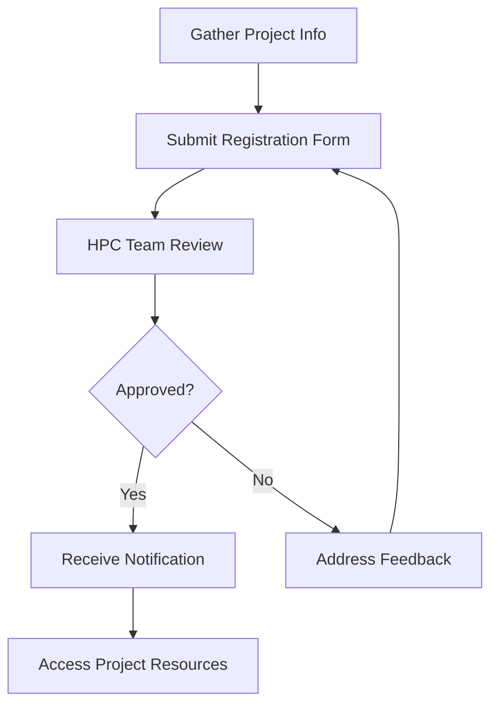

import SOPHeader from '@site/src/components/SOPHeader';

<SOPHeader
  documentCode="SOP-HPC-U002"
  title="Project Registration"
  version="1.0"
  status="Draft"
  effectiveDate="2026-01-18"
  category="User SOP"
  approvedBy="-"
  authors="Nattawet Sriwichai"
  lastUpdated="2026-01-18"
/>

## Purpose

To guide PIs and project leads through registering a research project to access shared resources on MedCMU-HPC.

## Scope

Applies to PIs or project leads who need to establish a project space on the HPC system.

## Roles & Responsibilities

| Role                            | Responsibility                                   |
| ------------------------------- | ------------------------------------------------ |
| **Principal Investigator (PI)** | Submits project registration, manages team       |
| **Team Members**                | Must have individual HPC accounts before joining |
| **HPC Administrator**           | Reviews, approves, and provisions project        |

## Default Resource Allocations

| Resource            | Standard Allocation        |
| ------------------- | -------------------------- |
| **Compute Credits** | 198.26 Service Hours (SHr) |
| **Project Storage** | 1 TB                       |
| **Scratch Storage** | 1 TB                       |

## Process Flow



## Procedure

### Step 1: Submit Project Registration Form

1. Navigate to **[Project Registration Form](https://cmu.to/medcmu-hpc-proj-register)**
2. Complete all sections: project info, team members, resource requirements
3. Submit the form

### Step 2: Wait for Approval

- Review within **5 business days**
- Large requests may require additional review

### Step 3: Access Your Resources

Once approved, you receive:

| Resource          | Details                |
| ----------------- | ---------------------- |
| Project Directory | `/project/<ProjectID>` |
| Scratch Directory | `/scratch/<ProjectID>` |
| Compute Credits   | 198.26 SHr             |

### Step 4: Verify Allocation

```bash
# Check storage quota
myquota

# Check compute balance
sbalance
```

### Step 5: Submit Jobs with Project Account

```bash
#SBATCH --account=<ProjectID>
```

## Expected Outcome

- ✅ Project directories created
- ✅ Storage and compute allocated
- ✅ Team members have access

## Related Documents

- [SOP-HPC-U001: Account Registration](./account-registration)
- [SOP-HPC-U003: Request Resources](./request-resources)
