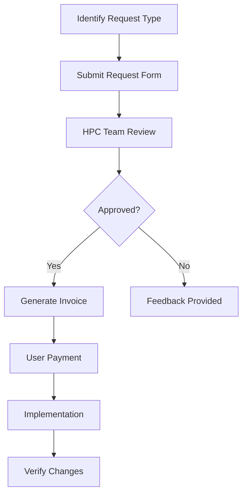

import SOPHeader from '@site/src/components/SOPHeader';

<SOPHeader
  documentCode="SOP-HPC-U003"
  title="Request Resources"
  version="1.0"
  status="Draft"
  effectiveDate="2026-01-18"
  category="User SOP"
  approvedBy="-"
  authors="Nattawet Sriwichai"
  lastUpdated="2026-01-18"
/>

## Purpose

To guide users through requesting additional resources or changes to their HPC account or project, including the payment process for resource allocation.

## Scope

Applies to requests for software installation, storage quota changes, account modifications, and special resource access.

## Roles & Responsibilities

| Role                  | Responsibility                              |
| --------------------- | ------------------------------------------- |
| **User**              | Submits resource request with justification |
| **PI**                | Approves significant resource changes       |
| **HPC Administrator** | Evaluates and implements requests           |
| **Finance (งานคลัง)** | Processes payment and issues receipts       |

## Process Flow



## Payment Workflow

The following diagram shows the complete payment workflow for resource requests:


### Workflow Description

| Step | Actor                 | Action                                        |
| ---- | --------------------- | --------------------------------------------- |
| 1    | **User/Researcher**   | Submits resource request via form             |
| 2    | **HPC Administrator** | Reviews request and calculates cost           |
| 3    | **HPC System**        | Generates invoice and service confirmation    |
| 4    | **User**              | Receives invoice notification                 |
| 5    | **Finance (งานคลัง)** | Processes payment                             |
| 6    | **Finance**           | Issues official receipt                       |
| 7    | **HPC Administrator** | Allocates resources upon payment confirmation |

---

## Request Types

| Request Type          | Approval      | Processing Time | Cost             |
| --------------------- | ------------- | --------------- | ---------------- |
| Software Installation | HPC Team      | 3-5 days        | Free             |
| Storage Increase      | PI + HPC Team | 3-5 days        | Per GB/month     |
| Compute Credits       | PI + HPC Team | 3-5 days        | Per Service Hour |
| Special Access        | PI + HPC Team | 3-5 days        | Varies           |

## Procedure

### Step 1: Submit Request

1. Navigate to **[Change Request Form](http://cmu.to/medcmu-hpc-req)**
2. Select request type
3. Provide justification and required details
4. Submit the form

### Step 2: Wait for Review

- HPC team reviews within **3-5 business days**
- For paid resources, you will receive an invoice

### Step 3: Payment (if applicable)

1. Receive invoice via email
2. Process payment through Faculty of Medicine finance (งานคลังคณะแพทยศาสตร์)
3. Submit payment confirmation to HPC team
4. Receive official receipt

### Step 4: Resource Allocation

Once payment is confirmed:

- HPC team allocates requested resources
- User receives confirmation email

### Step 5: Verify Changes

**For software**:

```bash
module avail <software_name>
```

**For storage**:

```bash
myquota
```

**For compute credits**:

```bash
sbalance
```

---

## Service Fees

| Resource Type     | Unit         | Rate             |
| ----------------- | ------------ | ---------------- |
| Storage (Project) | GB/month     | Contact HPC team |
| Compute Credits   | Service Hour | Contact HPC team |
| GPU Access        | Hour         | Contact HPC team |

:::info
For current pricing, please contact supporthpc-med@cmu.ac.th
:::

---

## Self-Service Options (Free)

Before requesting, consider self-service options:

**Python packages** - Install in virtual environment:

```bash
python -m venv ~/myenv
source ~/myenv/bin/activate
pip install <package>
```

**R packages** - Install in user library:

```r
install.packages("package_name")
```

**Apptainer containers** - Pull existing containers:

```bash
module load apptainer
apptainer pull docker://container/image:tag
```

---

## Checking Current Resources

### Storage Quota

```bash
myquota
```

### Compute Credits

```bash
sbalance
```

---

## Expected Outcome

- ✅ Request submitted successfully
- ✅ Invoice received (for paid requests)
- ✅ Payment processed
- ✅ Resources allocated
- ✅ User receives confirmation

## Related Documents

- [SOP-HPC-U002: Project Registration](./project-registration)
- [SOP-HPC-A003: Resource Allocation](/docs/SOP/Admin/resource-allocation)
