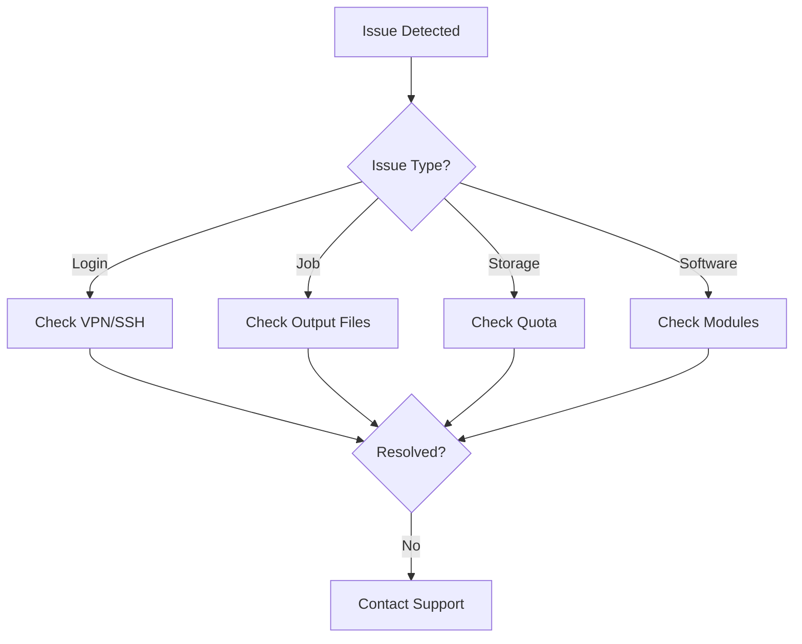

import SOPHeader from '@site/src/components/SOPHeader';

<SOPHeader
  documentCode="SOP-HPC-U005"
  title="Troubleshooting"
  version="1.0"
  status="Draft"
  effectiveDate="2026-01-18"
  category="User SOP"
  approvedBy="-"
  authors="Nattawet Sriwichai"
  lastUpdated="2026-01-18"
/>

## Purpose

To help users diagnose and resolve common HPC issues before contacting support.

## Scope

Covers login problems, job failures, quota issues, and software problems.

## Process Flow



## Login Problems

```bash
# Verbose SSH for debugging
ssh -v username@raptor.med.cmu.ac.th
```

## Job Failures

### Check Output Files

```bash
cat slurm-<jobid>.out
cat slurm-<jobid>.err
```

### Common Pending Reasons

| Reason                     | Solution               |
| -------------------------- | ---------------------- |
| `(Resources)`              | Reduce request or wait |
| `(Priority)`               | Wait for current jobs  |
| `(AssocGrpBillingMinutes)` | Request more credits   |

### Job Diagnostics

```bash
sacct --jobs=<id> --format=jobname,nnodes,ncpus,maxrss,elapsed
scontrol show jobid -dd <jobid>
```

## Storage Issues

```bash
# Check quota
myquota

# Check compute credits
sbalance
```

## Software Issues

```bash
# Search for software
module avail
module spider <software_name>

# Load module
module load <software>/<version>
```

## When to Contact Support

- ❌ Tried troubleshooting steps without success
- ❌ Suspect a system-wide issue
- ❌ Need software requiring admin installation

### Contact Options

| Method       | Contact                                              |
| ------------ | ---------------------------------------------------- |
| Email        | supporthpc-med@cmu.ac.th                             |
| Consultation | [Book a meeting](https://cal.com/nattawet-sri/30min) |

## Expected Outcome

- ✅ User can diagnose common issues
- ✅ Support requests include diagnostic info

## Related Documents

- [Getting Started](/docs/intro)
- [Using SLURM](/docs/Documentation/use-slurm)
