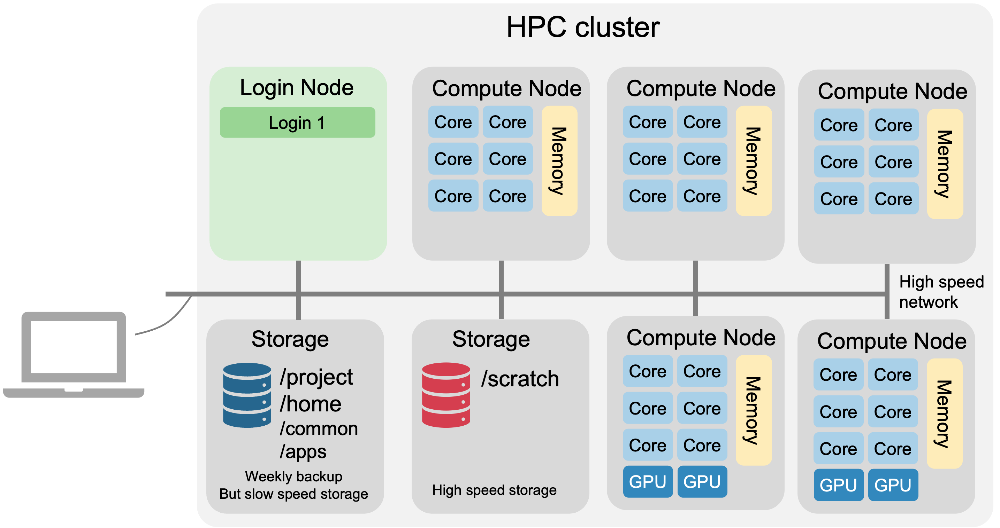
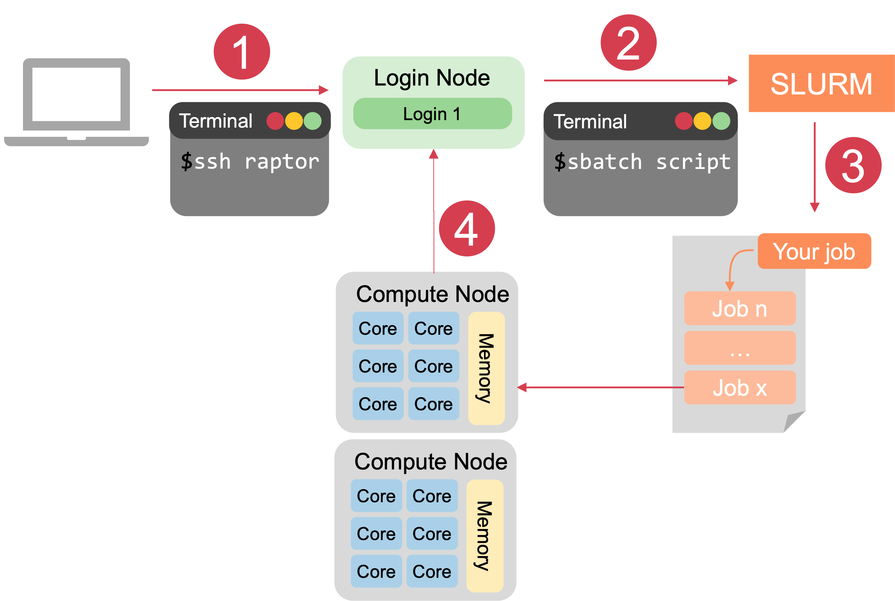

# Getting started

## Introduction

Faculty of Medicine, Chiang Mai Univerity (MedCMU) provided HPC Systems for medical health science research. We provide computing cluster, high performance and secure storage, software, and other services.

## Quick Start and General Information

### Documentation and Help
**Our documentation** is provided on **[documentation page](/docs/category/documentation)**. This guide just gives you a brief summary, so please go to documentation pages for more information.


**HPC User Guide CheatSheet**: For quick access to essential commands and workflows, download the **[HPC User Guide CheatSheet](./Documentation/img/MedCMU-HPC-CheatSheet.pdf)**. It includes guidance on logging in, file management, SLURM job submission, using modules, and running containers.


**Consult Support Team**: You can ask us about any related to MedCMU clusters, high-performance computing (HPC), or computing and programming in general on working day during 9:00 AM ~ 4:30 PM.
- **In person meeting**: Research Office Room, 9th Floor, 50th Year Anniversary Building, Faculty of Medicine, Chiang Mai University.
- **Online meeting via Zoom**: **[Booking here](https://cal.com/nattawet-sri/30min)**
- **Email**: nattawet.sri@cmu.ac.th


### Get Access
To get access to the cluster, please complete both the user registration and research project registration processes:
- HPC User Registration: **[Register here](https://cmu.to/medcmu-hpc-user-register)**
- Research Project Registration: **[Register here](https://cmu.to/medcmu-hpc-proj-register)**

Once submitted, you will receive a response to your request within **5 business days**.

### Request HPC Resources
To request software installation or make changes to your account or project, please use the following link.

- Change Request: **[Submit here](http://cmu.to/medcmu-hpc-change-req)**

---

## Our resources
### Background information: Clusters
If you are already familiar with clusters and schedulers, feel free to skip ahead to the next section. Otherwise, here is an overview.

#### What is a Computing Cluster?
A computing cluster is a powerful system made up of multiple individual computers (called nodes) that work together to perform complex calculations and tasks. The nodes are connected through a high-speed network, allowing them to communicate and share resources effectively.

#### The Components of a Cluster
A cluster consists of various components:



- **Nodes**: Individual computers in the cluster. Each node has its own **CPU** (processor), **memory** (RAM), local storage, and network interface.
- **Login Nodes**: These are special nodes that users log into using SSH (Secure Shell). From the login nodes, users can submit and manage jobs, access data, and visualize results.
- **Compute Nodes**: These nodes perform the actual processing for your jobs. When you submit a job, the scheduler allocates resources from the compute nodes.
- **Storage**: The cluster has several storage systems for saving data. This includes scratch storage (temporary storage for processing jobs) and project directories (long-term storage for user data).


#### How Does Slurm Manage Your Jobs?

The cluster uses a scheduler (Slurm in our system) to manage jobs and resources. Here's how it works when you submit a job:




1. Log in to the Cluster via Secure Shell (**SSH**)

    First, you need to log in to the cluster using SSH from your local machine to a login node. This allows you to interact with the cluster.

2. Submit Your **Job**

    To run a job, you need to submit a job script to **SLURM**. When submitting a job, you must specify:
    - *Number of **cores***: How many CPU cores you need for the job.
    - ***Memory***: How much memory (RAM) your job will require.
    - ***Time** limit*: How long you need to run the job (specified in hours/days).
    - *Program to use*: The application or script you wish to run.
  
    Once submitted, Slurm places your job in a **queue** with all other jobs that have been submitted by other users.

3. Job Execution

    When it’s your job's turn, and the necessary resources are available, SLURM will assign the required resources (such as CPU cores, GPU, memory) to your job on the available compute nodes. Then, Slurm will start your job and run it on those nodes.

4. Job Completion

    After your job finishes, SLURM stops the job, the output (results) is saved in your project directory or scratch storage, and then frees up the resources. These resources are now available for other jobs that are waiting in the queue.

---

## Using the Clusters
#### Logging in to the Cluster
To access the cluster, you’ll first log in to a login node via **SSH** (Secure Shell). If you’re on Windows, we recommend using MobaXTerm, while Linux or Mac users can use a terminal. The basic command to log in is:

```bash
ssh username@hostname
```
Note: Replace username with your own username.

Once logged in, you're connected to a login node where you can interact with the cluster.

:::note
For more details on connecting, visit our [connecting to the cluster page](/docs/Documentation/connect-server).
:::

#### Using Software Modules
Our cluster uses software modules for managing various programs. These modules allow you to load specific software versions based on your needs.

To view available modules:
```bash
module av
```
To load a module (e.g., Python):
```bash
module load python
```
To list the modules you’ve loaded:
```bash
module list
```
If you want to remove all modules:
```bash
module purge
```

:::note
For more information on using modules, see our [Module System page](/docs/Documentation/environment-modules).
:::

#### Submitting Jobs with SLURM
We use SLURM as the job scheduler to manage tasks across the cluster. You can run jobs interactively or as batch jobs.

**Interactive Jobs**

Interactive jobs are useful for tasks like testing, development, or running short applications.

For example, to start Python interactively with `srun`:

```bash
module load python/3.12.7
srun -p short -t 1:00:00 --mem=4G -c 1 --pty python
```
This command requests:

 - 1 hours of runtime (-t 1:00:00)
 - 4 GB of memory (--mem=4G)
 - 1 CPU cores (-c 1)
 - Once the job starts, you'll be able to interact with Python directly.


**Batch Jobs**

For longer jobs, or to run multiple jobs at once, batch jobs are more suitable. Batch jobs don't require you to be logged in.

Create a script (e.g., `cal_score.sbatch`) with the SLURM parameters and commands:

```bash title="cal_score.sbatch"
#!/bin/bash

#SBATCH -p short
#SBATCH -t 0-00:05
#SBATCH -c 1
#SBATCH --mem 4G

module load python/3.12.7
python3 /common/demo/mean_score.py 85 90 78 92 88
```

To submit the job, use the `sbatch` command:
```bash
sbatch cal_score.sbatch
```
This job will run in the background, and you can check the output later.

**Managing Jobs**

To monitor the status of your jobs, use:
```
squeue
```
This will show your jobs in the queue, their status, and the nodes being used. If you need to cancel a job:
```
scancel <job_id>
```
Replace `<job_id>` with the actual job ID you want to cancel.

You can also request email notifications when your job starts or finishes. See the Slurm documentation for more options.

Optionally, you can configure Slurm to send you an email notification when your job starts, finishes, or encounters an issue. For details on how to set this up, refer to the [Slurm documentation](/docs/Documentation/use-slurm).
