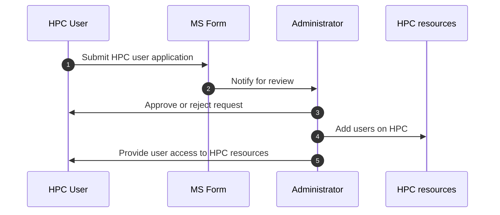
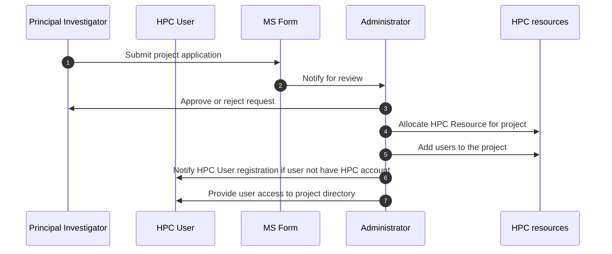

# Get Access to HPC

To gain access to the High Performance Computing (HPC) cluster, you need to complete two registration processes:

> **Note:** This resource is provided for research staff and graduate students of the Faculty of Medicine, Chiang Mai University **only**.

## 1. HPC User Registration

Before you can use the HPC cluster, you must first register as a user. Please follow the steps below:

1. **Complete the User Registration Form:** [HPC User Registration](https://cmu.to/medcmu-hpc-user-register)

2. **Review Process:**
   Once submitted, the administrator will review your application and either approve or reject the request.

3. **Access Provided:**
   If approved, you will be added to the HPC system and given access to the available resources.

### User Registration Flow

---

## 2. Research Project Registration

After registering as a user, you must also register your research project. This ensures that your work is linked to the appropriate resources. Follow these steps:

1. **Complete the Project Registration Form:** [Research Project Registration](https://cmu.to/medcmu-hpc-proj-register)

2. **Review Process**: Once submitted, the administrator will review your project application and approve or reject it.

3. **Project Resource Allocation**: After approval, the required HPC resources will be allocated to your project.

4. **User Access to Project**: If you are a new user, you will be added to the project and provided with access to its directory.

### Project Registration Flow

---

## Response Time

After submitting both registration forms, you will receive a response to your request within **5 business days**.

If you have any questions or encounter any issues during the registration process, please feel free to contact our support team. We are here to assist you!
